# Canopy 使用教程

更新时间：2026 年 9 月

## 先认识界面

Canopy 是三栏结构，先记住每栏是干什么的，后面就都好说了。

**最左边细窄的一条**是会话栏：切换 Agent / Chat 模式、新建会话、搜索（放大镜，搜全部历史会话）、以及你所有会话的入口。最底下两个是「更多工作区工具」和「设置」。

**中间**是你和 AI 对话的地方。输入框右下角那个小圆环是**上下文占用**指示器，点开能调自动压缩阈值。

**最右边**是工作区，也是 Canopy 和普通聊天软件最不一样的地方——文件、改动、浏览器、终端、笔记库、Skills、MCP、Todo、日程、定时任务、项目记忆，都在这里以标签页的形式打开。点标签栏右上角的 **+** 就能看到全部可开的标签。

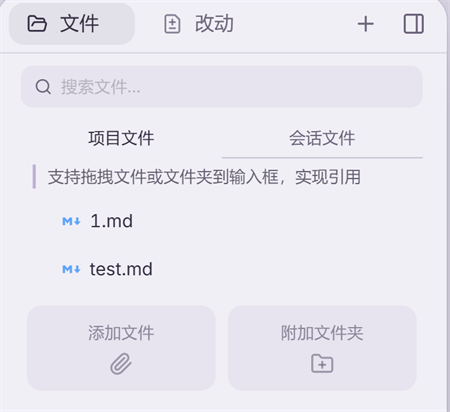

## 快速开始

### 必要依赖

Canopy 依赖 Git 和 Node.js 运行时环境。首次启动时会检测并引导你完成安装。

Windows 用户会看到更多的依赖安装步骤，请跟随向导完成即可。

### 配置 AI 供应商

AI 供应商就是各家大模型厂商提供的 API 接入配置。Canopy 支持几乎所有主流大模型厂商。

**配置渠道：** 填上你在各家平台申请的 API Key 即可使用。左下角齿轮进入设置，选「模型配置」→「添加配置」：

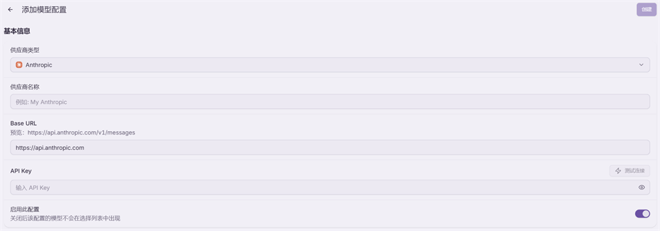

支持的类型包括 DeepSeek、Kimi、OpenAI、Anthropic、GLM、MiniMax 等及其兼容格式。填完 API Key 可以先点「测试连接」验一下，再到下方「可用模型」里点「从供应商获取」把模型列表拉下来。

> 注：Agent 模式不挑渠道协议，OpenAI、Anthropic、Google、智谱、豆包、通义千问、xAI 以及自定义兼容地址都能用来跑 Agent。有限制的反而是 **Chat 模式**——订阅登录类渠道（ChatGPT 订阅、xAI 订阅）在 Chat 里会提示「Chat 模式暂不支持…，请切换到 Agent 模式使用」，换到 Agent 模式即可。

设置里还有这些地方，用到时再来找：

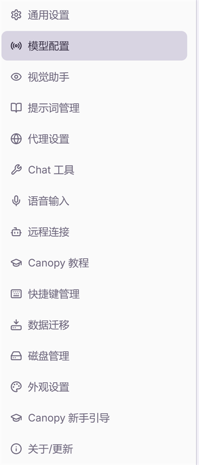

### Agent 模式 vs Chat 模式

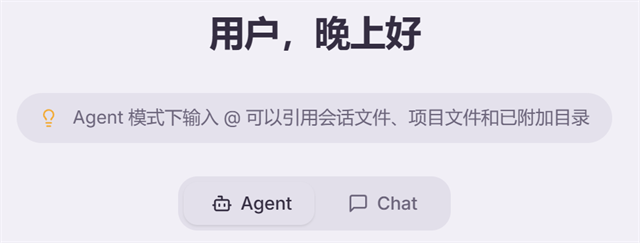

**Agent 模式**：AI 具备动手能力，可以读写文件、执行工具、调用 Skills。适合需要实际产出的任务——写代码、生成文档、分析数据、自动化流程等。

**Chat 模式**：纯对话，不能直接操作文件或调用工具。适合咨询、头脑风暴、问答类场景。

简单来说：Chat 帮你想，Agent 帮你做。

如果你刚开始使用，建议从 Agent 模式入手，配合内置的 `canopy-coach` Skills 可以获得使用指导。在 Agent 输入框中输入斜杠命令，选择 `canopy-coach` 即可激活。

### 输入框的五个触发符

输入框的提示文字已经把它们写出来了，这五个符号是 Canopy 最高频的操作：

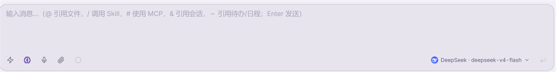

| 符号 | 作用 | 什么时候用 |
| --- | --- | --- |
| `@` | 引用文件 | 让 Agent 明确读某个文件，比描述文件名可靠得多 |
| `/` | 调用 Skill | 手动触发某个工作流 |
| `#` | 使用 MCP | 指定用某个外部工具 |
| `&` | 引用会话 | 把另一个会话的结论带进来，不用复述 |
| `~` | 引用待办 / 日程 | 让 Agent 看到你的任务和时间安排（见「Todo、日程与定时任务」一节） |

打字太长可以用语音输入（`Ctrl` + `` ` `` 唤起，见「快捷键、快速任务与语音输入」一节），口语化表达也没问题。

## 文件设计

### 为什么需要文件

Agent 的核心能力是读写文件。右侧文件区域的所有内容都可以被 Agent 访问和使用。如果你明确需要 Agent 读取或编写某个文件，可以通过 @ 引用或自然语言描述来指定。

### 三层文件结构

**会话文件** — 只服务当前任务。适合临时输入、计划、阶段性产物。把文件拖到输入框时，默认加入当前会话。

**项目根目录** — 项目的长期工作主目录。所有会话共享，适合放代码库、长期参考资料、最终交付物。本地项目的修改会直接写入原始文件。

**附加目录** — 额外授权的外部资料。适合参考库、素材库、Obsidian 仓库等不想复制进项目的内容。

三层的取舍就一句话：**这次用完就扔的放会话文件，反复要用的放项目根目录，别人的、不想复制一份的用附加目录。**

### 会话的最佳实践

一个会话只处理一个简短的任务。避免在同一会话中进行几十上百次交互——过长的上下文会增加成本、拖慢响应、降低模型表现。

如果任务很长需要跨会话，可以让 Agent 在项目根目录的 `.context/` 中维护设计文档和进度记录，新会话时让 Agent 继续阅读即可。

### 想试另一种做法：探索分支

有时候进行到一半你会想「换个思路试试」，但又舍不得现在的进度。这时候用**探索分支**：鼠标移到那条消息上，点分叉图标（第三个），就会**从这一步岔出一条支线**。

- 主线原封不动留着，你可以随时切回去
- 支线里怎么折腾都行，试坏了直接丢
- 试出好结果，**结论可以带回主线**

比「先备份一份再改」省事得多，也比「在同一个会话里推翻重来」干净——推翻重来会把失败的尝试留在上下文里，白白占地方还干扰模型判断。

### 写好提示词

给 Agent 的指令要完整、明确。人与人对话时可以省略很多背景，但 Agent 需要你把上下文说清楚。

一个好的提示词通常包括：
- 相关文件的 @ 引用
- 任务的完整描述和期望产出
- 格式或质量要求
- 不确定时的处理方式（停下来问你，还是自行判断）

最后一条最容易被忽略，但最值钱。加上「不确定的地方先问我，不要自己猜」这一句，能挡掉大部分返工。

## Skills 技能系统

### 什么是 Skills

Skills 是结构化的提示词工作流。把你的工作流程、判断标准、专业知识用语言描述出来，Agent 就能反复按照这套流程执行。

核心价值：一次沉淀，无限复用。同一工作区内无需重复描述，Agent 会自动识别并应用相关 Skills。

### 创建 Skills

两种常见场景：

1. **主动创建**：在 Agent 模式下描述你的工作流，Canopy 内置的 `skill-creator` Skills 会帮你把它转化为可复用的 Skills。

2. **事后沉淀**：完成一次任务后觉得做得不错，直接告诉 Agent「把刚才的流程变成 Skills」。

创建后记得检查 Skills 的具体内容是否符合预期，因为它会被反复执行。

### 使用和管理 Skills

在输入框打一个 `/`，已开启的 Skills 就会列出来：

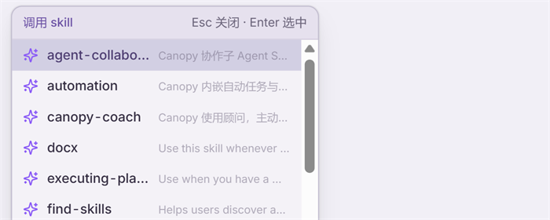

在右侧工作区打开「Skills」标签，可以看到全部 Skills 并逐个开关：

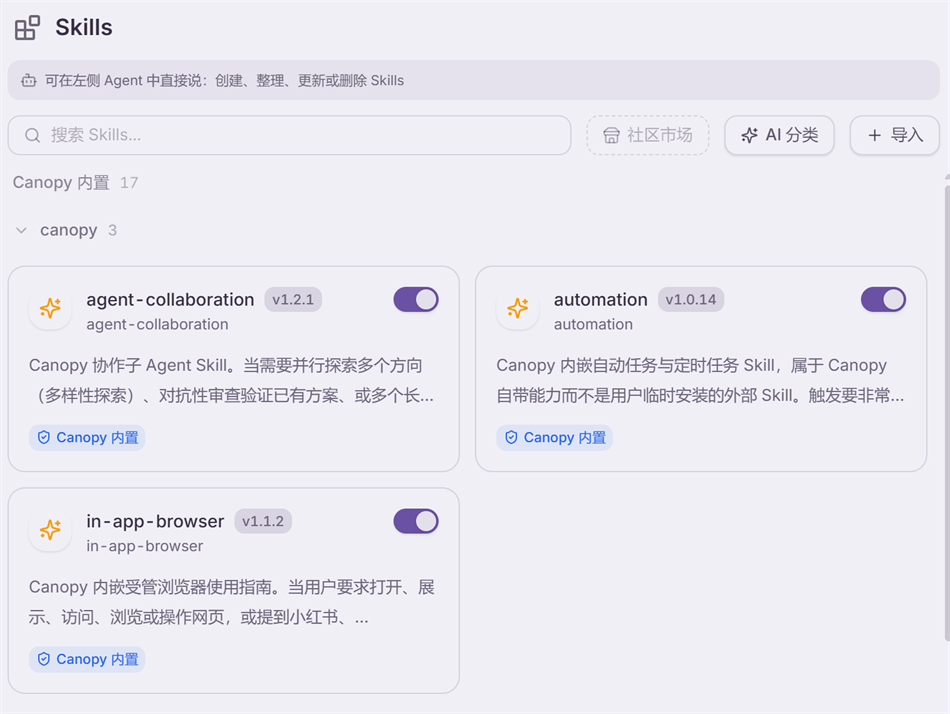

- 左下角也会展示当前工作区已开启的 Skills 和 MCP
- 不需要的 Skills 可以随时关闭
- 支持导出和分享：让 Agent 帮你压缩打包，对方收到后同样通过 Agent 解压安装

> 建议：不要安装太多 Skills。过多的 Skills 会让语义模糊，影响 Agent 判断。只保留经过实际验证、确实有效的。

### MCP 工具

MCP（Model Context Protocol）是扩展 Agent 工具能力的协议。右侧工作区的「MCP」标签里有一份预置目录，点「配置」或「连接」，Agent 会一步步带你完成接入：

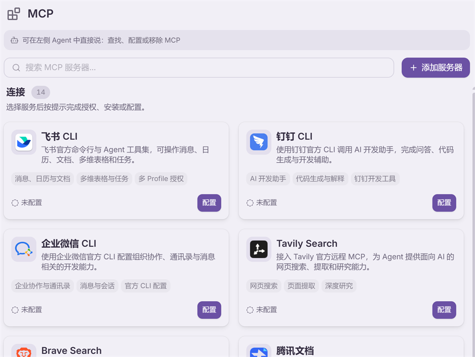

你也可以直接在对话里说「帮我装一个 xx 的 MCP」，Agent 会去查官方文档并配置。需要 API Key 时它会用内置浏览器带你去官方页面自己获取——**不会向你要密码，也不会读你的 Cookie**。

### 项目记忆（AGENTS.md）

Skills 是「怎么做事的流程」，项目记忆是「**这个项目是怎么回事、你是个什么样的人**」。侧边栏的「项目记忆」（或 Skills 面板顶部的「记忆」标签）就是它：

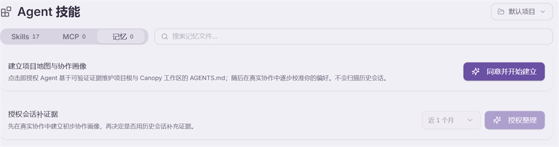

它维护的是项目根目录下的 `AGENTS.md`——Agent 每次开工都会先读这份文件。里面记的是**可验证的事实**：这个项目的结构、用什么技术栈、有哪些约定、你偏好什么风格。

两个按钮对应两级授权，分得很清楚：

- **同意并开始建立** —— 授权 Agent 基于项目里**能验证的证据**（目录结构、配置文件、代码）来写 `AGENTS.md`，然后在往后的真实协作中逐步校准你的偏好。**这一步不会去翻你的历史会话。**
- **授权整理** —— 想让它再准一点，可以额外授权它读**最近一段时间的历史会话**来补充证据（时间范围自己选）。这是**单独的一次决定**，不勾就不会发生。

**什么时候值得建**：同一个项目你要反复用 Canopy 干活。建好之后，「这个项目用的是 xxx，请按 xxx 风格」这类话就不用每次重复交代了。

**手动写也完全可以**：`AGENTS.md` 就是个普通 markdown 文件，你可以直接编辑，写上「所有金额保留两位小数」「不要用 emoji」「改动前先给我计划」这类规矩。Agent 会当成项目级指令遵守。

## 内置浏览器

Canopy 自带一个真正可用的浏览器，就在右侧工作区。它不只是给 Agent 用的——**你可以自己上手操作它**，这一点很关键。

### 最实用的用法：你先登录，然后交给 Agent

很多网站要登录才能干活（公司后台、电商平台、内部系统）。做法是：

1. 在右侧工作区打开浏览器，自己访问那个网站
2. **像平常一样自己输账号密码、过验证码、点确认** —— 这就是个正常浏览器，你怎么点都行
3. 登录好之后，直接让 Agent 干活：「帮我把后台这个月的订单导出来」

Agent 用的是**同一个浏览器、同一份登录状态**，不需要你把密码告诉它，它也不用重新登录。

**登录状态会被保存下来**，关掉应用再打开还在，不用每次重登。

### 登录状态按项目分开存

同一个项目下的所有会话共享一份登录状态——在项目里登录一次，这个项目的其他任务直接就能用。

换到别的项目就是另一套身份。这是故意的：你在「公司项目」里登的公司账号，不会跑到「个人项目」里去。

### 标签页怎么用

右侧工作区的标签栏可以同时放浏览器、终端、文件、改动等各种标签：

- **标签太多装不下**：鼠标放在标签栏上**滚滚轮**就能左右滚；底下那条细横条也能直接拖
- **调整顺序**：按住标签**左右拖**，其他标签会自动让开，松手就落在那儿
- **两个标签并排看**：把标签**往下拖出标签栏**，拖到内容区左半边或右半边，松手即可分屏（比如左边看网页、右边看代码）
- **关闭标签**：从某个网页点开的新页面是**独立的**，关掉原来那个标签不会把它一起关掉

### 让 Agent 用浏览器

直接说就行：「打开必应搜一下 xxx」「去这个网址把表格数据抓下来」「登录后台看看今天有没有新订单」。

下面这张是真实的一轮：左边是对话，右边是它打开的网页，中间那条就是**活动条**——它开了哪个页面、抽了哪块区域，全部实时显示，你随时能看见它在干什么。

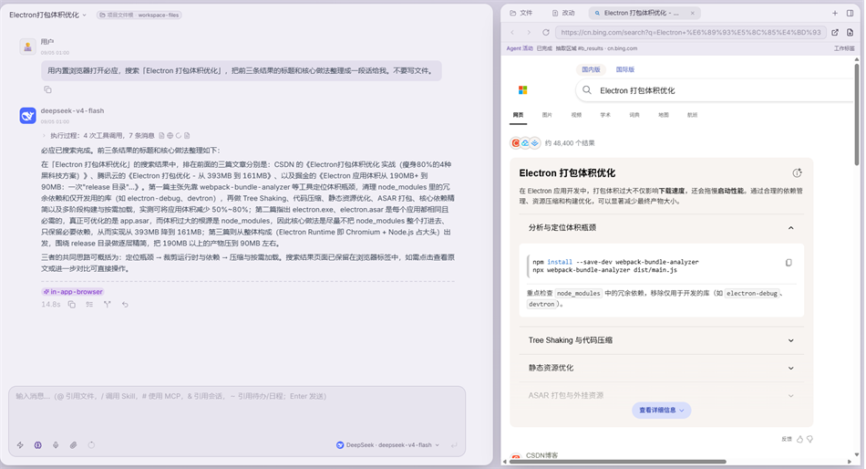

活动条单独放大是这样：

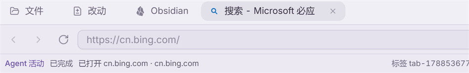

需要下载文件时，文件会存到受控的下载目录，Agent 可以告诉你放在哪了。

### 能拿浏览器干成什么

这是 Canopy 和「只会聊天的 AI」差别最大的地方。列四类真正常用的：

**一、查资料、找方法（不用登录）**

> 打开必应搜索「xxx 的几种实现方案」，把前五条结果各自的核心做法整理成一张对照表，标明各自的适用场景和代价。**哪些是原文写的、哪些是你的判断，分开标。**

比让 AI 凭记忆回答可靠得多——网页留在标签里，你随时能点开核对它有没有瞎编。

**二、社群 / 客服：让它起草，你来发**

这是很多人最实际的用法。做法是**你先登录，它再干活**：

1. 在右侧工作区打开浏览器，自己登录社群或客服后台
2. 然后说：

> 后台我已经登录好了。把未读消息里问产品的挑出来，按我们的口径逐条起草回复，**先给我看，不要直接发**。拿不准的单独列出来问我。

关键在最后那句。**让它起草、你过目再发**——这样既省了打字，又不会出现「AI 替你说错话」。等你确认它的口径稳定了，再放开一点权限也不迟。

想让它按你的风格说话，把常见问题和标准答法整理进一个 Skills，以后每次自动套用，不用重复交代。

**三、去网站上办事**

导出报表、填表单、批量查询、核对订单——凡是「在网页上点来点去」的重复劳动都可以交出去：

> 后台已登录。把这个月的订单导出成表，按渠道分类汇总，输出到项目根目录。导出过程中遇到需要确认的弹窗，停下来问我。

**四、跨站对比**

> 分别打开这三个网址，把它们的价格、规格、发货时间抓下来做成一张对照表，最后给我一句结论。

标签页可以并排看（把标签往下拖出标签栏就能分屏），你能对着原页面核对它抓得对不对。

> ⚠️ 三条边界，用之前先看清楚：
> - Agent **不会向你要密码，也不会读你的 Cookie**。需要登录的一律你自己登。
> - 涉及**发送、下单、付款、删除**这类不可逆操作，务必在指令里写明「先给我确认」。
> - 网页内容是外部信息，Agent 可能被页面上的文字误导。重要结论自己点开原页面核一眼。

## 终端

右侧工作区的 **+** 里可以开「新建终端」。它就是一个正常终端，你自己敲命令、看输出，**和 Agent 用的是同一台机器、同一个项目目录**。

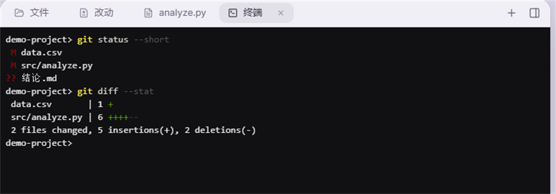

用得最多的两个场合：

- **Agent 跑完，你自己复核一下**。它说「改好了」，你在终端 `git status`、`git diff` 亲眼看一遍，比听它汇报踏实
- **有些事你自己敲更快**。装依赖、跑测试、看日志，不必绕一圈让 Agent 转述

改动面板里每个文件、每个目录的悬停菜单里也有「在右侧标签中打开终端」，会直接以那个目录为工作目录开一个，省得自己 `cd`。

## 改动面板：它到底动了哪些文件

这是把 Agent 用得放心的关键一环。**只要项目根目录是个 Git 仓库**，右侧「改动」标签就会列出当前所有改动：

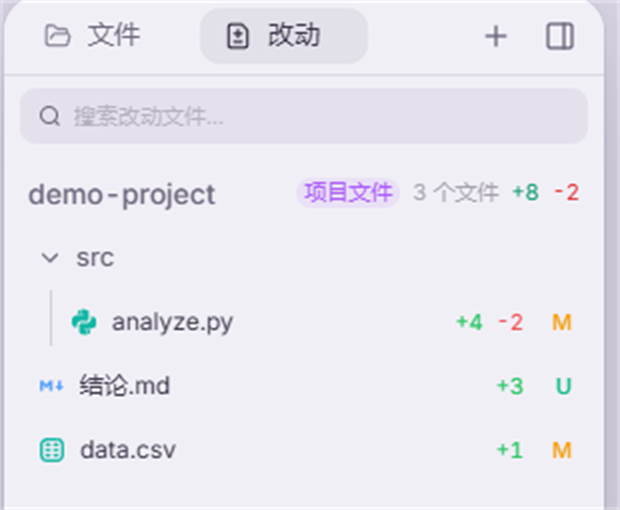

一行一个文件，右边是**增了几行、删了几行**，以及状态字母（`M` 改过、`U` 新增还没纳入版本管理）。顶上那个紫色小标签标出这些改动**来自哪一层**——会话文件 / 项目文件 / 附加目录文件，一眼看清 Agent 动的是临时文件还是你的正式代码。

点开任意一个文件，就是逐行对比：

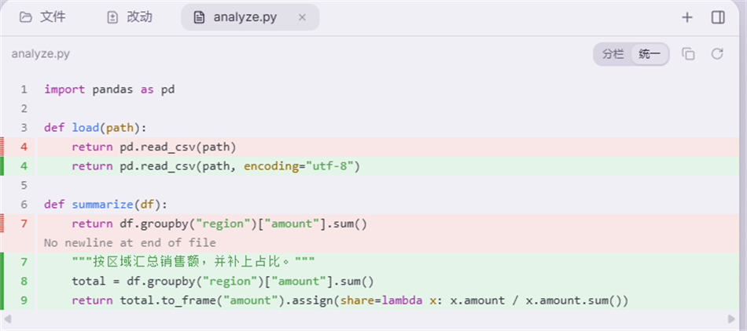

红色是删掉的行、绿色是新增的行，右上角能在**分栏对照**和**统一视图**之间切换。

### 建议的工作节奏

1. 让 Agent 干活
2. **干完先看「改动」**，不要直接相信它的文字总结——文字说「小改一处」但列表显示动了 8 个文件，这种情况是有的
3. 逐个点开核对，觉得哪个文件改坏了，在它的悬停菜单里点 **还原文件变更** 单独退回
4. 都没问题了，再自己去提交

> 一个提醒：**改动面板只在项目根目录是 Git 仓库时才有内容**。不是仓库会显示「当前目录不是 Git 仓库，或暂无文件改动」。想让 Agent 改你的正式文件又能随时回退，**先把那个目录 `git init` 一下**，成本很低，收益很大。

## 笔记库（Obsidian）

侧边栏的「Obsidian」是一个 Markdown 笔记库，可以当日常笔记本用，也能让 Agent 读写。

- **已经在用 Obsidian**：Canopy 会自动发现你的 Vault，直接接管，还是那些笔记
- **没用过 Obsidian**：不用装任何东西，Canopy 自带一个笔记库，直接开写
- 编辑器支持实时 Markdown、双链引用、属性面板、代码高亮；**停止输入 0.7 秒后自动保存**，也可以按 Ctrl+S 立即存
- 选中笔记里的文字会弹出「复制文本」，复制的是你看到的样子（没有 Markdown 符号），转发到微信、QQ 很方便
- 左侧文件树可以收起，收起后正文占满整个宽度；再点角落那个按钮就能展开回来，下次打开还是你上次的状态

原来的「草稿页」已经并入笔记库，里面的内容会自动迁移过来，不会丢。

## 让 Agent 做一份 PPT

在 Agent 模式里说「做一份 X 的 PPT」，内置的 `canopy-ppt` Skill 会接手：先问你几道选择题，再按步骤出片，怎么做由你决定。

1. **问清需求**：页数、语言、制作方式（快速 / 标准）、产物形态（默认「可编辑 PPTX」，文字和形状都是 PowerPoint 原生对象，可逐字改；也可选整页矢量贴图的高保真版、网页 PPT，或只要 SVG）、图片策略，一次问完。快速模式只问主题，其余按推荐默认走。
2. **调研（可选）**：配了搜索 Key 就用搜索接口；没配就用内置浏览器搜必应，任何模型都能用。深度档会逐个来源读全文并留下引用。
3. **大纲**：按金字塔原理出一页一结论的大纲，标准模式会停下来让你改。
4. **风格**：六张风格卡、随包的三个模板包、沿用你自己旧 PPT 的底图，或自定义配色；也可以和 Agent 从零一起设计一套独一份的；定制或共创出来的风格可以存成你自己的风格卡，下次直接选，升级也不会丢。封面先出两版让你选，选定后整份锁定。
5. **制作**：每页一张 1280×720 的矢量 SVG，按便当网格排版，数字只来自你的材料，不编造。
6. **质检与交付**：结构自检加截图复核，产物在工作目录的 `ppt/<主题>/` 下：`deck.pptx`、逐页 SVG、联系表和一份「怎么改」说明。可编辑版里饼图、折线、斜线箭头这类原生画不了的元素会原位嵌成矢量小图，其余照常可编辑，交付说明会逐页列出。

几条要知道的：

- 交付的 PPTX 每页是一张矢量图，PowerPoint 2016 以上和新版 WPS 直接打开、缩放不糊；文字不能逐字改，改字请改对应的 SVG 再让 Agent 重新合成那一页。原生可编辑版本在后续版本提供。
- 不做 AI 生图，图片只用你提供的。
- 看不了图的模型（比如 DeepSeek 的纯文本版本）会把截图交给视觉助手复核，前提是设置里配好了视觉助手。
- 编辑已有的 PPTX 直接让 Agent 用内置 Office 工具改；想要单文件网页 PPT，在第 1 步选「网页 PPT」。

## 让 Agent 做一份 PSD 设计稿

海报、封面、Banner、社媒配图、UI 稿这类要交给设计师或自己在 Photoshop 里继续改的东西，在 Agent 模式里说「做一份 X 的 PSD」，内置的 `canopy-psd` Skill 会接手。不需要你装 Photoshop，也不需要装 Python。

1. **问清需求**：尺寸与用途（海报 1080×1920、公众号头图 900×383、A4 300dpi 等常用尺寸它都记得）、风格、文案、素材从哪来、要不要透明底 / 多画板 / 参考线，一次问完；你说「你看着办」就按默认走。
2. **先列图层清单**：背景、装饰、主体、文字各自成层，自下而上排好，你先看一眼再动手。
3. **逐层制作再合成**：得到一个 `.psd` 和一张同名的预览图。Photoshop 打开后每一层都在：文字是可编辑的文字层，按钮、色块、几何装饰是可拖锚点的矢量形状层，压暗 / 去色 / 反相这类调色是保留滑块的调整层，你给的照片可以嵌成智能对象（双击就能替换），多尺寸交付时一个文件里放几块画板。
4. **自检**：Agent 会把合成图看一遍——文字有没有溢出、元素有没有重叠、留白匀不匀——不满意自己改了重出，也可以只把某一层单独导出来看。
5. **改已有的 PSD**：把文件放进项目目录，说「把标题改成 X」「换掉产品图」「隐藏水印层」，Agent 先读图层树，再逐层改，默认另存新文件不动原稿。

几条要知道的：

- 在右侧「文件」面板点开 `.psd` 就能看到合成图和图层树，点眼睛可以临时隐藏某一层看效果，不改文件。
- 预览图是近似渲染，投影、发光、描边、调整层这些以 Photoshop 里的实时效果为准；文字用的是你系统里的字体，Photoshop 缺字体会提示替换，文字不会丢。
- 暂不支持 `.psb`（超大文档）；CMYK 文件按 RGB 近似显示。
- 机器上装了 Python 和 psd-tools 的话预览会自动升级成更保真的引擎，没装也完全能用。

## Office 文件预览

Word、Excel、PPT 文件在 Canopy 里可以直接点开看，排版接近原文件的样子，不用切到 Office。

PDF、图片、代码文件同样支持内联预览，Photoshop 的 `.psd` 也能点开看合成图和图层。文件打不开时会明确告诉你原因（比如文件被移动或删除了），而不是一片空白。

## 让不会看图的模型也能看图

有些模型（比如 DeepSeek 的纯文本版本）本身不认识图片，发张截图过去它只能干瞪眼。**视觉助手**就是干这个的——设置 › 视觉助手：

原理很直白：**你发图 → 先由你指定的视觉模型把图转成文字描述 → 再把文字交给当前对话模型**。Chat 和 Agent 都生效，图片本身不会发给当前对话渠道。

- **视觉模型**从你已有的渠道里选，复用那个渠道已保存的 API Key，不用再配一次
- 下面可以逐个勾选**哪些模型需要补齐**。DeepSeek V4 这类已知的纯文本模型会自动补，原生支持看图的模型不用勾
- **视频助手**是同一套思路：视频先由 Kimi 视频模型转成文字描述再交给当前模型（任何对话模型都无法直接接收视频）。这条只有 Kimi API 渠道支持

> **这是要外发数据的功能，边界写在设置页最底下，原文抄给你：**
> 「启用即授权在需要时将对话附件或已授权目录中的 PNG、JPEG、GIF、WebP 图片，以及最多 1000 字符的视觉问题发送给所选模型；单张上限 10MB。视觉结果只会以文本形式返回。启用视频助手即授权将 MP4、MOV、WebM 等视频（单个上限 100MB）上传至 Moonshot 文件服务用于生成描述，**完成后立即删除远端文件**。」
>
> 换句话说：**发给谁是你选的模型，发什么有明确上限，视频用完即删。** 不放心就别开，开了也只在你真的发图时才走这条路。

## 快捷键、快速任务与语音输入

### 三个全局快捷键（应用没在前台也能用）

这三个最容易被忽略，但它们能让 Canopy 从「一个要切窗口的应用」变成「随手就能用的东西」：

| 快捷键 | 作用 |
| --- | --- |
| `Alt` + `Space` | 唤起**快速任务**浮窗（macOS 为 `Option` + `Space`） |
| `Ctrl` / `⌘` + `Shift` + `P` | 显示并聚焦主窗口 |
| `Ctrl` + `` ` `` | 唤起**语音输入**浮窗 |

**快速任务浮窗**是个轻量输入框：打字、粘图或拖文件进去、选 Chat 还是 Agent（`⌘1` / `⌘2`）、回车发送，`Esc` 关闭。适合「脑子里刚冒出一件事，不想打断手头的活」——敲 `Alt+Space`，说完就走，Canopy 在后台接着干。

**语音输入浮窗**更有意思：它写入的是**当前光标位置**。如果唤起时 Canopy 是激活窗口就写进对话框；如果你正在别的应用里（写文档、填表单、回消息），它就写到那个应用里去。也就是说这是一套**全系统可用的语音转文字**。自动粘贴失败时内容会保留在剪贴板，不会丢。

> 语音输入需要先在 设置 › 语音输入 里接入火山引擎的豆包流式语音识别（填 APP ID、Access Token、Resource ID，页面上有取值指引，可以点「测试连接」验证）。
>
> 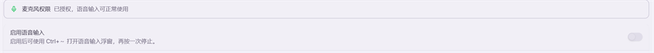
>
> 里面还有两个值得调的：
>
> - **识别语言** — 默认「自动识别」，中英文和方言混着说也认
> - **自定义热词** — 把产品名、技术词、人名填进去，明显改善这些词的识别准确率

### 常用应用内快捷键

| 快捷键 | 作用 |
| --- | --- |
| `Ctrl` + `Shift` + `M` | 切换 Chat / Agent 模式 |
| `Ctrl` + `Shift` + `F` | 全局搜索（搜对话和会话） |
| `Ctrl` + `F` | 在当前对话 / 文件预览 / Diff 面板里查找 |
| `Ctrl` + `L` | 聚焦输入框 |
| `Ctrl` + `Shift` + `B` | 显示 / 隐藏右侧文件面板 |
| `Ctrl` + `\` | 显示 / 隐藏内联 Diff / 文件预览面板 |
| `Ctrl` + `W` | 关闭当前标签 |
| `Ctrl` + `K` | 清除当前对话的上下文 |
| `Ctrl` + `Shift` + `Backspace` | 停止 Agent |
| `Ctrl` + `+` / `-` / `0` | 放大 / 缩小 / 重置界面 |

> macOS 上表中的 `Ctrl` 多数对应 `⌘`（应用内快捷键走 CommandOrControl）；以设置页实际显示为准。

全部快捷键在 设置 › 快捷键管理 里，都可以改，也可以单独关掉某一个（全局快捷键有可能和系统或别的软件撞车，撞了就在这里换一个）。

### 顺带一提：提示词管理

设置 › 提示词管理 管的是 **Chat 模式**的系统提示词。可以新建自己的，也可以用内置的；还有个小开关叫「追加日期时间和用户名」，会在提示词末尾自动补上当前时间和你的名字——问「今天」「这周」这类问题时有用。

Agent 模式不走这里，Agent 的项目级指令写在 `AGENTS.md`（见「项目记忆」一节）。

## 界面外观

设置 › 外观设置里可以调：

- **界面风格**：经典（旧版视觉）／现代（更小圆角、更清晰的分割线）
- **Canopy 配色**：12 套自研配色，浅色深色各 6 套（每套一组同调性的六色，不是一个色相刷全场）
  - 浅色：青杉映雪（近白纸面，浅色里对比最清晰）、云絮柔灰、海雾初晴、林间晓色、拿铁暖阳（暖调奶咖）、薰衣草雾（灰紫）
  - 深色：青杉沉夜（带青的深炭，不追纯黑，暗色下层次仍在）、远洋夜航、松涛入夜、陶土暮色、荧屏余晖（CRT 终端感）、墨色极夜（近纯黑，夜里最护眼，OLED 屏还省电）
  - 新安装默认是「青杉沉夜」；换过主题的话，你选的那套会一直保留
- **界面缩放**：Ctrl + `+` 放大、Ctrl + `-` 缩小、Ctrl + `0` 恢复
- **Markdown 字号**：小／中／大，调整 AI 回复和编辑器的正文字号

> Windows 上不支持更换应用图标（任务栏图标由安装包固定），这一区会置灰。macOS 可以换 Dock 图标。

## 复制文字的两种方式

- **想复制整条消息**：点消息下方的「复制」按钮，复制的是 Markdown 原文（带 `**`、`#` 这些符号，适合贴进代码或再编辑）
- **想复制一段话去转发**：直接**选中文字**，会弹出「复制文本」，复制的是你看到的样子，没有 Markdown 符号，粘到微信、QQ 里很干净

Agent 会话、Chat 会话、笔记库、文件预览都支持选中复制。

## 找回以前聊过的东西

用久了会话会有几百条。左侧会话栏上方的**放大镜**是全局搜索：

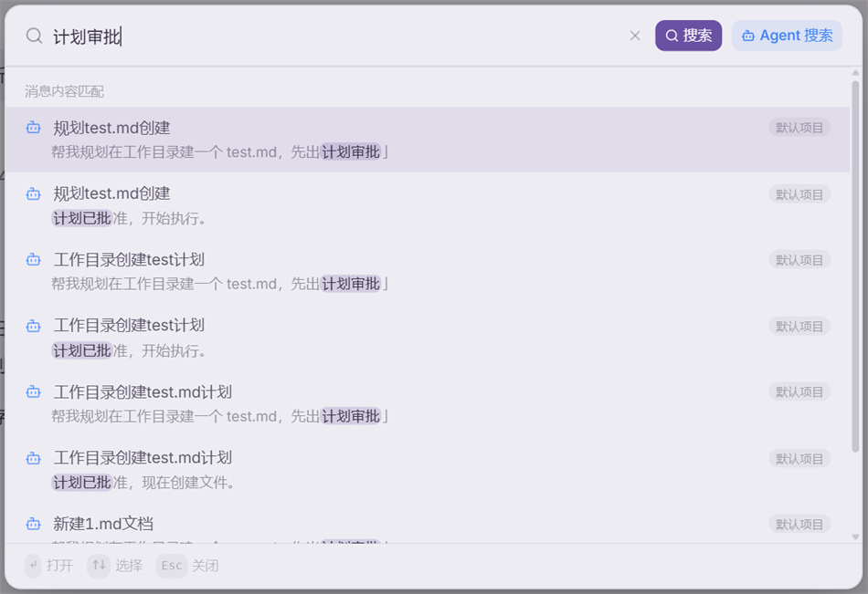

- **标题和消息内容一起搜**，Chat 和 Agent 两种会话都在范围内，命中的词会高亮
- 输入后**按 Enter 或点「搜索」才执行**——不是边打边搜。会话多了以后逐键扫描全部历史会卡，所以做成手动触发
- 结果右侧的小标签是它属于哪个项目

**想不起确切词怎么办**：点右边的「**Agent 搜索**」。它会新开一个 Agent 会话，让 Agent 去翻你的全部会话文件，按**语义**找——你只要描述「上个月讨论过的那个导出方案」，不需要记得原话。

## 上下文与自动压缩

Agent 每轮都要把之前的对话一起发给模型，聊得越久占用越多。占满了会出问题，所以 Canopy 会在快满时**自动压缩**历史——把前面的对话浓缩成摘要，腾出空间接着聊。

输入框右下角那个**小圆环**就是上下文占用指示器，点开看明细：

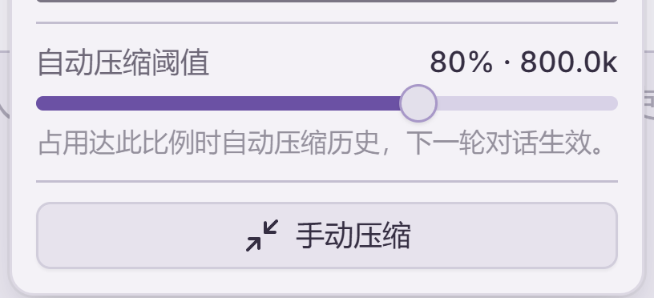

- 弹层上半部分是**这一轮的 token 明细**和当前占用百分比
- **自动压缩阈值**默认 **80%**，可以在 **50% ~ 95%** 之间拖（每档 5%）
- 快到阈值时圆环会变**琥珀色**提醒你
- 底下的「**手动压缩**」可以随时立刻压一次

**阈值怎么选**：调低（比如 60%）压得更勤，每次发给模型的内容更少、更省钱，但**摘要会丢细节**；调高（比如 90%）保留的原文更多、上下文更完整，但每轮更贵、也更接近撑爆的边缘。

**不确定就别动，80% 是权衡过的默认值。**

> 为什么不能设到 100%：压缩触发后模型还得有空间写摘要、跑完当前这一轮。留得太少会直接撞上「上下文超长」报错，而不是走压缩。

最省事的办法其实还是前面说过的那条：**一个会话只做一件事**。做完就新开一个，压根到不了压缩阈值。真要跨会话接力，就让 Agent 把进度写进项目根目录的 `.context/`，新会话读一下就能接上——比压缩摘要靠谱得多。

## 用量统计：到底用掉了多少

上面那个圆环看的是「**当前这个会话**占了模型上下文的多少」，是个瞬时值。想知道「**一共**用掉了多少」，去「设置 → 用量统计」。

这一页把本机 **Agent 会话**的 token 汇总起来看（Chat 模式暂不记录用量，不在统计里）：

- **统计范围**：今天 / 近 7 天 / 近 30 天 / 全部，按每次模型调用的实际发生时间筛
- **总览**：合计 token、模型调用次数、涉及会话数和**缓存命中率**，并按输入 / 输出 / **缓存读取** / **缓存写入**拆开；后面按日期、模型、渠道、会话列出的每一行，也都带这几项和该行的缓存命中率
- **按日期**：哪天用得多一目了然
- **按模型**：同一个模型跨会话累计，看清楚是谁在吃 token
- **按渠道**：按你自己起的渠道名分开
- **按会话**：用量最高的会话排在前面，可以顺着找到「哪次任务特别贵」

几点说明：

- 统计**只在本机进行**，读的是已经存在你电脑上的会话记录，不上传任何东西
- **只统计 token，不折算金额**——各家单价不同、还会变，换算出来的数字只会误导你。要看钱去各渠道自己的账单页
- 「缓存读取」通常占大头，那是多轮对话里重复送进去的上下文，多数渠道对这部分计价更低，所以**别拿总量直接乘单价**
- **缓存命中率** = 缓存读取 ÷（输入 + 缓存读取 + 缓存写入），即发出去的输入里有多少是从缓存读的；鼠标悬停在数字上能看到这个口径

## Todo、日程与定时任务

这三个是同一个模块的三个子页，一起用才顺手：**Todo 管「要做什么」，日程管「什么时候做」，定时任务管「让 Agent 自己去做」。**

> 如果右侧工作区的 **+** 菜单里没看到 Todo 和日程，去 设置 › 通用设置 打开对应开关。关掉只是隐藏入口，**Agent 依然能管理它们**。

### Todo

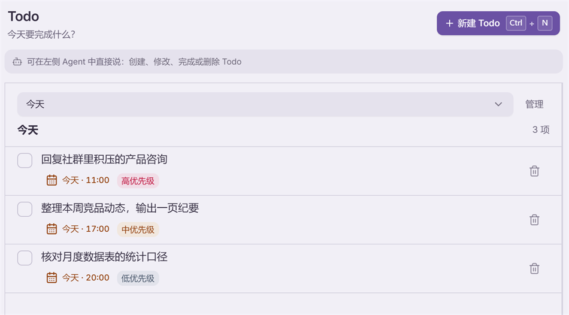

最省事的用法不是自己点「新建」，而是**在对话里顺口说**：

> 把刚才那三件事记成今天的 Todo，第一件标高优先级，下午 5 点前要做完。

反过来也行——Agent 干活时可以读你的 Todo。在输入框打 `~` 就能引用：

> ~ 看一下我今天的待办，哪几件其实可以合并成一件？帮我重排个顺序。

聊天里任何一条消息，鼠标移上去点那个列表图标就能**直接变成 Todo**：

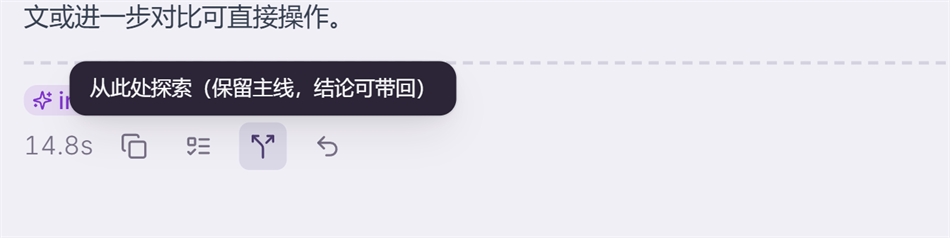

顺带说另外两个：

- **从此处探索** — 从这一步岔出一条支线去试别的方案，主线原样保留，结论可以带回来。适合「我想试试另一种写法，但不想毁掉现在的进度」
- **回退到此处** — 把会话退回这一步重新来过

### 日程

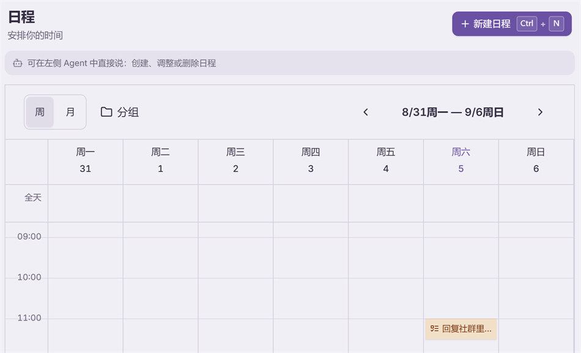

日程和 Todo 是打通的：**给 Todo 设了时间，它就会出现在日程的时间轴上**，不用录两遍。同样可以直接说：

> 周三下午两点到四点安排「季度复盘」，提前半小时提醒我。

### 定时任务

前两个是给你自己看的，定时任务是**让 Agent 到点自己去干**。适合日报、监控、周期性检查这类重复劳动。

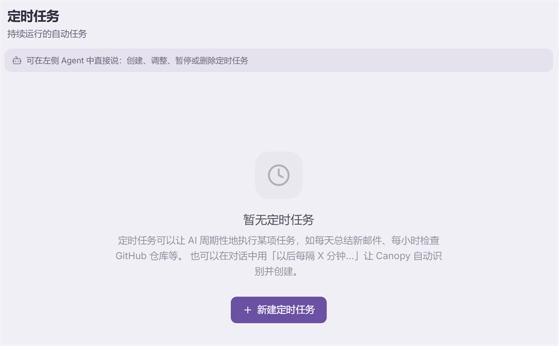

**创建方式：推荐直接跟 Agent 说**，不要一上来就手动填表——

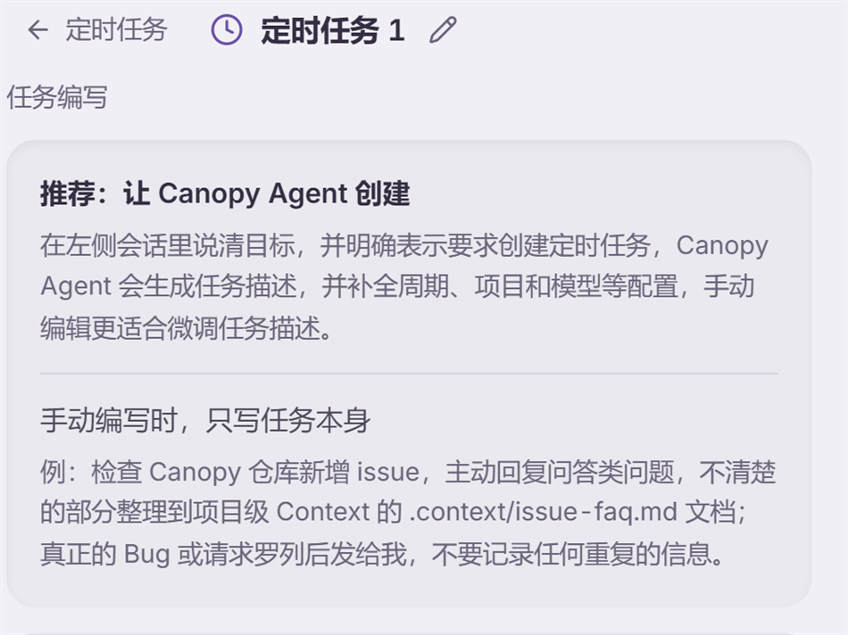

最自然的路径是：先跟 Agent 完整做一次这件事，确认结果满意，然后说：

> 把刚才这个流程做成定时任务，每天早上 9 点跑一次，结果推到飞书。

手动编写时**只写任务本身**（要做什么、什么情况下告诉我），周期、模型、项目在右侧配置：

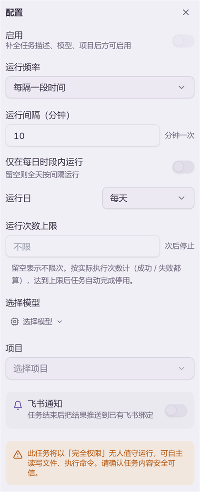

几个容易忽略的开关：

- **运行次数上限** — 留空是无限次；成功失败都计数，到数后任务自动停用
- **仅在每日时段内运行** — 比如只在上班时间跑，留空则全天按间隔跑
- **飞书通知** — 跑完把结果推送到已绑定的飞书

> ⚠️ **注意配置页底下那条红字**：定时任务以「完全权限」无人值守运行，可以自主读写文件、执行命令，**没有人在旁边点确认**。所以：任务描述要写清楚边界，第一次建好**先手动「运行一次」看结果**，稳定了再启用。不确定的事情不要交给它无人值守地做。

### 三个串起来是这样

一条完整链路，把前面几节都用上了：

> 每天早上 9 点，用浏览器打开这几个页面看有没有更新；有更新就整理成一段话，**并给我建一条今天的 Todo**；没有就什么都不做。结果推到飞书。

浏览器负责取信息 → Agent 判断 → 变成 Todo 落到你的日程上 → 定时任务让它每天自动跑 → 飞书让你在手机上收到。你只需要在早上看一眼。

## 远程访问

Canopy 支持通过即时通讯工具远程使用 Agent，目前支持飞书、微信、钉钉。设置 › 远程连接：

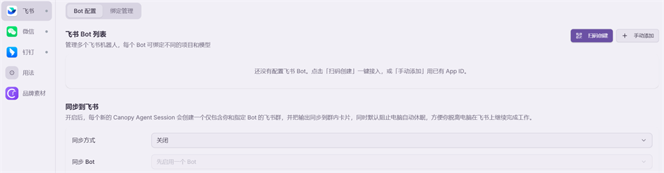

**飞书（推荐）**：支持流式卡片，体验最佳。还支持 CLI 集成，可以打通飞书文档、会议、日程等能力。配置过程扫码即可完成。

**微信 / 钉钉**：基础对话能力可用，功能相对有限。

**同步到飞书**：开启后，每个新建的 Agent 会话都会创建一个只有你和指定 Bot 的飞书群，并把执行过程同步成群内卡片；同时默认阻止电脑自动休眠，方便你离开电脑后在飞书上接着看、接着说。

> 记住一件事：远程访问是**你自己那台电脑**在干活，手机只是遥控器。所以电脑要开着、Canopy 要在运行。

## 六类场景，照着抄就能用

下面六组是最常见的用法。每组给一句可以直接复制到输入框的话，你把里面的文件名和要求换成自己的即可。

### 一、日常办公

**典型任务**：多张表汇总、合同发票整理成台账、会议纪要转待办、周报月报。

把这个月的表格全拖进项目根目录，然后说：

> 读一下项目里这几个 xlsx，按部门把销售额汇总成一张月度表，输出成 xlsx 放在项目根目录。**口径不一致的地方先列出来问我，不要自己决定。**

做完之后，如果下个月还要做同样的事，再补一句：

> 把刚才的流程做成 Skills，下次我说「跑月报」你就照这个来。

再往前一步，让它自己跑：

> 把这个流程做成定时任务，每月 1 号早上 9 点执行，结果推到飞书。

**推荐配置**：项目根目录放固定的数据文件夹；开启飞书远程访问，通勤路上就能看结果。

### 二、开发与技术

**典型任务**：读陌生代码库、写测试、定位 bug、代码审查、补技术文档。

把仓库设为项目根目录或附加目录，第一句话建议先「只读不改」：

> 先不要改任何代码。把这个仓库的模块划分、数据流向、以及你觉得最容易出问题的三个地方讲清楚，写到 `.context/architecture.md`。

定位问题时给足上下文：

> @src/api/user.ts @src/api/user.test.ts 这个接口在并发下偶发 500。先复现，再说原因，最后才改。每一步都告诉我你的依据。

**关键习惯**：
- **一个会话只做一件事**。修完一个 bug 就新开会话，不要在一个会话里干十件事
- 长任务用 `.context/` 接力：让它把进度写进去，新会话第一句就是「读 `.context/`，接着干」
- 右侧「改动」标签能看到它改了哪些文件，逐条核对再提交
- 需要跑命令时开一个「终端」标签，你和 Agent 看到的是同一个终端

### 三、内容创作与自媒体

**典型任务**：选题、找素材、写稿改稿、一稿多平台改写、整理评论区。

先自己在内置浏览器里登录你的创作后台，然后：

> 我已经在浏览器里登录好后台了。把最近 20 篇的标题和阅读量抓下来，做成表格，告诉我哪类标题表现最好。

改写的时候把约束说死：

> @draft.md 这篇改写成小红书风格，控制在 800 字以内，开头三行要有钩子，结尾带 5 个标签。另外给我 3 个备选标题。

**两个提效点**：
- 写完的内容**选中文字**会弹出「复制文本」，复制出来是干净的纯文本，直接粘进公众号后台不用再清格式
- 把你的行文规范（禁用词、语气、结构模板）写成一个 Skills，以后每次自动套用，不用重复交代

### 四、社群运维与客服

**典型任务**：回消息、答重复问题、汇总反馈、盯着几个群别漏消息。

这类活的特点是**量大、重复、但错不起**。所以流程要设计成「Agent 起草、你拍板」：

先自己在内置浏览器里登录社群或客服后台，然后：

> 后台我登录好了。把未读里问产品的挑出来，按我们的口径逐条起草回复，**先给我看，不要直接发**。拿不准的单独列出来问我。

跑顺之后往前推三步：

1. **沉淀口径**——「把刚才这些问答整理成一个 Skills，以后按这个口径回」。下次就不用再交代语气和标准答法了。
2. **每天自动扫一遍**——「做成定时任务，每天 9 点、14 点各扫一次未读，有问产品的就整理给我，顺便建一条 Todo」。
3. **人不在电脑前也能处理**——配好飞书远程访问，通勤路上在飞书里说「刚才那批草稿念给我听，第 2 条改得客气一点」。

**汇总反馈**也很省事：

> 把这周社群里提到的问题和吐槽抓下来，按出现频次排序，分成「产品缺陷 / 使用不会 / 需求建议」三类，每类给两条原话。

> ⚠️ 社群场景务必守住一条：**默认让它起草，不让它直接发**。等你看过几十条、确认口径稳了，再考虑放开。指令里那句「先给我看，不要直接发」不要省。

### 五、学习与研究

**典型任务**：实验数据处理、画图、写论文、做答辩 PPT、读文献。

**处理实验数据**——把原始数据放进项目根目录：

> @data/raw.csv 按这个流程处理：去掉前两次预实验、每组算均值和标准差、做单因素方差分析。画一张带误差棒的柱状图，显著性标在图上。输出处理后的表和 png。**每一步用了什么公式和参数都写在旁边。**

**做 PPT**：

> @outline.md 按这份大纲做一份 12 页的答辩 PPT，每页不超过 5 行字，重点数据用图不用文字，输出 pptx。

**读文献**——把 PDF 拖进来：

> 把这几篇论文按「研究问题 / 方法 / 主要结论 / 局限」四栏整理成一张对照表。**哪些是原文写的、哪些是你的概括，要分开标出来。**

**必须养成的一个习惯**：涉及数据、引用、结论时，明确要求 Agent 区分「原文有的」和「它推断的」。它可以帮你算、帮你整理、帮你排版，但**结论要你自己核**——这在学术场合不是客气话。

**沉淀建议**：把导师或期刊的格式要求（图表编号规则、引用格式、字号字距）写成一个 Skills，以后每篇都自动套用。

### 六、团队与群聊

**典型任务**：手机上派活、离开电脑后继续跟进、把结果同步给同事。

配好飞书 Bot 之后，你在飞书里对 Bot 说话就等于在 Canopy 里说话：

> 把昨天的服务日志跑一遍异常检查，有问题发我，没问题回一个「正常」就行。

开启「同步到飞书」后，每个新会话都会开一个只有你和 Bot 的群，执行过程实时变成群内卡片——你在地铁上就能看它做到哪一步了。

**协作场景**：定时任务的结果推到飞书群，全组都能看到；谁有疑问直接在群里追问，Agent 接着答。

**注意**：远程用的是你那台电脑的算力和登录状态，所以电脑要开着。开启飞书同步模式后 Canopy 会默认阻止电脑自动休眠。

## 关于 Canopy Community

Canopy Community 基于 AGPL-3.0 开源协议发布，是在 Proma 基础上修改而来的社区版本。

- 源代码与问题反馈：[GitHub](https://github.com/peter00101/canopy-community)

感谢使用，祝你用得顺手。
